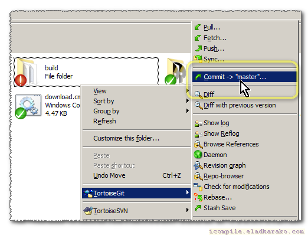

<h1>  Adblock-No-Whitelist</h1>

<h2>The Most Popular Adblock Lists. No Whitelist-Entries. </h2>

You are probably familiar with few of those Adblock-lists:
<pre>
Adblock Warning Removal List                   https://easylist-downloads.adblockplus.org/antiadblockfilters.txt
Anti-Adblock Killer by Reek                    https://raw.githubusercontent.com/reek/anti-adblock-killer/master/anti-adblock-killer-filters.txt
EasyList                                       https://easylist.to/easylist/easylist.txt
EasyPrivacy                                    https://easylist.to/easylist/easyprivacy.txt
EasyPrivacy without international filters      https://easylist-downloads.adblockplus.org/easyprivacy_nointernational.txt
EasyList without element hiding rules          https://easylist-downloads.adblockplus.org/easylist_noelemhide.txt
Fanboy's Annoyance List                        https://easylist.to/easylist/fanboy-annoyance.txt
Fanboy's Social Blocking List                  https://easylist.to/easylist/fanboy-social.txt
EasyList Germany                               https://easylist.to/easylistgermany/easylistgermany.txt
EasyList Italian                               https://easylist-downloads.adblockplus.org/easylistitaly.txt
EasyList Dutch                                 https://easylist-downloads.adblockplus.org/easylistdutch.txt
EasyList French                                https://easylist-downloads.adblockplus.org/liste_fr.txt
EasyList Chinese                               https://easylist-downloads.adblockplus.org/easylistchina.txt
EasyList Chinese CJX's Annoyance List          https://raw.githubusercontent.com/cjx82630/cjxlist/master/cjx-annoyance.txt
EasyList Bulgarian                             http://stanev.org/abp/adblock_bg.txt
EasyList Indonesian                            https://raw.githubusercontent.com/heradhis/indonesianadblockrules/master/subscriptions/abpindo.txt
EasyList Arab                                  https://easylist-downloads.adblockplus.org/Liste_AR.txt
Easylist Czech/Slovak                          https://raw.githubusercontent.com/tomasko126/easylistczechandslovak/master/filters.txt
Easylist Latvian                               https://notabug.org/latvian-list/adblock-latvian/raw/master/lists/latvian-list.txt
EasyList Hebrew                                https://raw.githubusercontent.com/easylist/EasyListHebrew/master/EasyListHebrew.txt
EasyList Lithuanian                            http://margevicius.lt/easylistlithuania.txt
Adblock Warning Removal List                   https://easylist-downloads.adblockplus.org/antiadblockfilters.txt
EasyList Spanish                               https://easylist-downloads.adblockplus.org/easylistspanish.txt
EasyList Romanian                              https://www.zoso.ro/pages/rolist.txt
EasyList Russian                               https://easylist-downloads.adblockplus.org/advblock.txt
EasyList Icelandic                             https://adblock.gardar.net/is.abp.txt
EasyList Japanese                              https://raw.githubusercontent.com/k2jp/abp-japanese-filters/master/abp_jp.txt
Blockzilla by zpacman                          https://raw.githubusercontent.com/zpacman/Blockzilla/master/Blockzilla.txt
I don't care about cookies                     https://www.kiboke-studio.hr/i-dont-care-about-cookies/abp/
Prebake - Filter Obtrusive Cookie Notices      https://raw.githubusercontent.com/liamja/Prebake/master/obtrusive.txt
</pre>

Whitelist-entries are Adblock-rules to allow, and override a previous blocking with the same list or other-one,
when used for good, it helps to allow several innocent elements or links to successfully load-up or to be shown,
when used for evil, it can be used to allow paid-ads, self-promoting and similar malicious demeanor.

Updating on your own time, from your own repository:
<pre>
 0.1-- fork the project
 0.2-- to find out what are your links are, go to your repository, browse to one of the files under the 'build' folder and click the "raw" button.
 0.3-- clone it to your Windows running PC.
 0.4-- have python installed somewhere (and set in PATH).

 1.1-- run <code>download.cmd</code> and wait for it to finish.
 1.2-- you will have a new <code>build</code> folder, including both the original and the no-whitelist version.
 1.3-- commit and push to your repository.
 1.4-- click on "update" button on your <a href="https://chrome.google.com/webstore/detail/ublock-origin/cjpalhdlnbpafiamejdnhcphjbkeiagm">uBlock Origin</a> (if you have AdBlock or AdBlock Plus uninstall it immediately and install <a href="https://chrome.google.com/webstore/detail/ublock-origin/cjpalhdlnbpafiamejdnhcphjbkeiagm">uBlock Origin</a> instead.
 
 2.1-- next week (or two) repeat the steps 1.1 to 1.4 to get an updated version. You're a big boy (or girl).
</pre>

This git-repository has the following links (change the username from <code>eladkarako</code> to your-own unless you want to download from my build..)
<code>&#60;a type=&#34;text&#47;plain;charset=UTF-8&#34; download=&#34;filename.txt&#34; href=&#34;https:&#47;&#47;raw.githubusercontent.com&#47;eladkarako&#47;Adblock-No-Whitelist&#47;master&#47;build&#47;filename.txt&#34;&#62;filename.txt&#60;&#47;a&#62;</code>

And here are direct links (to this repository's build..)
<pre>
<a type="text/plain;charset=UTF-8" download="___last_updated___.txt" href="https://raw.githubusercontent.com/eladkarako/Adblock-No-Whitelist/master/build/___last_updated___.txt">___last_updated___.txt</a>
<a type="text/plain;charset=UTF-8" download="__Adblock_Warning_Removal_List.txt" href="https://raw.githubusercontent.com/eladkarako/Adblock-No-Whitelist/master/build/__Adblock_Warning_Removal_List.txt">__Adblock_Warning_Removal_List.txt</a>
<a type="text/plain;charset=UTF-8" download="__Anti-Adblock_Killer_by_Reek.txt" href="https://raw.githubusercontent.com/eladkarako/Adblock-No-Whitelist/master/build/__Anti-Adblock_Killer_by_Reek.txt">__Anti-Adblock_Killer_by_Reek.txt</a>
<a type="text/plain;charset=UTF-8" download="__Blockzilla_by_zpacman.txt" href="https://raw.githubusercontent.com/eladkarako/Adblock-No-Whitelist/master/build/__Blockzilla_by_zpacman.txt">__Blockzilla_by_zpacman.txt</a>
<a type="text/plain;charset=UTF-8" download="__EasyList.txt" href="https://raw.githubusercontent.com/eladkarako/Adblock-No-Whitelist/master/build/__EasyList.txt">__EasyList.txt</a>
<a type="text/plain;charset=UTF-8" download="__EasyList_Arab.txt" href="https://raw.githubusercontent.com/eladkarako/Adblock-No-Whitelist/master/build/__EasyList_Arab.txt">__EasyList_Arab.txt</a>
<a type="text/plain;charset=UTF-8" download="__EasyList_Bulgarian.txt" href="https://raw.githubusercontent.com/eladkarako/Adblock-No-Whitelist/master/build/__EasyList_Bulgarian.txt">__EasyList_Bulgarian.txt</a>
<a type="text/plain;charset=UTF-8" download="__EasyList_Chinese.txt" href="https://raw.githubusercontent.com/eladkarako/Adblock-No-Whitelist/master/build/__EasyList_Chinese.txt">__EasyList_Chinese.txt</a>
<a type="text/plain;charset=UTF-8" download="__EasyList_Chinese_CJX_Annoyance_List.txt" href="https://raw.githubusercontent.com/eladkarako/Adblock-No-Whitelist/master/build/__EasyList_Chinese_CJX_Annoyance_List.txt">__EasyList_Chinese_CJX_Annoyance_List.txt</a>
<a type="text/plain;charset=UTF-8" download="__EasyList_Czech_and_Slovak.txt" href="https://raw.githubusercontent.com/eladkarako/Adblock-No-Whitelist/master/build/__EasyList_Czech_and_Slovak.txt">__EasyList_Czech_and_Slovak.txt</a>
<a type="text/plain;charset=UTF-8" download="__EasyList_Dutch.txt" href="https://raw.githubusercontent.com/eladkarako/Adblock-No-Whitelist/master/build/__EasyList_Dutch.txt">__EasyList_Dutch.txt</a>
<a type="text/plain;charset=UTF-8" download="__EasyList_French.txt" href="https://raw.githubusercontent.com/eladkarako/Adblock-No-Whitelist/master/build/__EasyList_French.txt">__EasyList_French.txt</a>
<a type="text/plain;charset=UTF-8" download="__EasyList_Germany.txt" href="https://raw.githubusercontent.com/eladkarako/Adblock-No-Whitelist/master/build/__EasyList_Germany.txt">__EasyList_Germany.txt</a>
<a type="text/plain;charset=UTF-8" download="__EasyList_Hebrew.txt" href="https://raw.githubusercontent.com/eladkarako/Adblock-No-Whitelist/master/build/__EasyList_Hebrew.txt">__EasyList_Hebrew.txt</a>
<a type="text/plain;charset=UTF-8" download="__EasyList_Icelandic.txt" href="https://raw.githubusercontent.com/eladkarako/Adblock-No-Whitelist/master/build/__EasyList_Icelandic.txt">__EasyList_Icelandic.txt</a>
<a type="text/plain;charset=UTF-8" download="__EasyList_Indonesian.txt" href="https://raw.githubusercontent.com/eladkarako/Adblock-No-Whitelist/master/build/__EasyList_Indonesian.txt">__EasyList_Indonesian.txt</a>
<a type="text/plain;charset=UTF-8" download="__EasyList_Italian.txt" href="https://raw.githubusercontent.com/eladkarako/Adblock-No-Whitelist/master/build/__EasyList_Italian.txt">__EasyList_Italian.txt</a>
<a type="text/plain;charset=UTF-8" download="__EasyList_Japanese.txt" href="https://raw.githubusercontent.com/eladkarako/Adblock-No-Whitelist/master/build/__EasyList_Japanese.txt">__EasyList_Japanese.txt</a>
<a type="text/plain;charset=UTF-8" download="__EasyList_Latvian.txt" href="https://raw.githubusercontent.com/eladkarako/Adblock-No-Whitelist/master/build/__EasyList_Latvian.txt">__EasyList_Latvian.txt</a>
<a type="text/plain;charset=UTF-8" download="__EasyList_Lithuanian.txt" href="https://raw.githubusercontent.com/eladkarako/Adblock-No-Whitelist/master/build/__EasyList_Lithuanian.txt">__EasyList_Lithuanian.txt</a>
<a type="text/plain;charset=UTF-8" download="__EasyList_Romanian.txt" href="https://raw.githubusercontent.com/eladkarako/Adblock-No-Whitelist/master/build/__EasyList_Romanian.txt">__EasyList_Romanian.txt</a>
<a type="text/plain;charset=UTF-8" download="__EasyList_Russian.txt" href="https://raw.githubusercontent.com/eladkarako/Adblock-No-Whitelist/master/build/__EasyList_Russian.txt">__EasyList_Russian.txt</a>
<a type="text/plain;charset=UTF-8" download="__EasyList_Spanish.txt" href="https://raw.githubusercontent.com/eladkarako/Adblock-No-Whitelist/master/build/__EasyList_Spanish.txt">__EasyList_Spanish.txt</a>
<a type="text/plain;charset=UTF-8" download="__EasyList_without_element_hiding_rules.txt" href="https://raw.githubusercontent.com/eladkarako/Adblock-No-Whitelist/master/build/__EasyList_without_element_hiding_rules.txt">__EasyList_without_element_hiding_rules.txt</a>
<a type="text/plain;charset=UTF-8" download="__EasyPrivacy.txt" href="https://raw.githubusercontent.com/eladkarako/Adblock-No-Whitelist/master/build/__EasyPrivacy.txt">__EasyPrivacy.txt</a>
<a type="text/plain;charset=UTF-8" download="__EasyPrivacy_without_international_filters.txt" href="https://raw.githubusercontent.com/eladkarako/Adblock-No-Whitelist/master/build/__EasyPrivacy_without_international_filters.txt">__EasyPrivacy_without_international_filters.txt</a>
<a type="text/plain;charset=UTF-8" download="__Fanboys_Annoyance_List.txt" href="https://raw.githubusercontent.com/eladkarako/Adblock-No-Whitelist/master/build/__Fanboys_Annoyance_List.txt">__Fanboys_Annoyance_List.txt</a>
<a type="text/plain;charset=UTF-8" download="__Fanboys_Social_Blocking_List.txt" href="https://raw.githubusercontent.com/eladkarako/Adblock-No-Whitelist/master/build/__Fanboys_Social_Blocking_List.txt">__Fanboys_Social_Blocking_List.txt</a>
<a type="text/plain;charset=UTF-8" download="__I_do_not_care_about_cookies.txt" href="https://raw.githubusercontent.com/eladkarako/Adblock-No-Whitelist/master/build/__I_do_not_care_about_cookies.txt">__I_do_not_care_about_cookies.txt</a>
<a type="text/plain;charset=UTF-8" download="__Prebake_Filter_Obtrusive_Cookie_Notices.txt" href="https://raw.githubusercontent.com/eladkarako/Adblock-No-Whitelist/master/build/__Prebake_Filter_Obtrusive_Cookie_Notices.txt">__Prebake_Filter_Obtrusive_Cookie_Notices.txt</a>
<a type="text/plain;charset=UTF-8" download="__no_whitelist___Adblock_Warning_Removal_List.txt" href="https://raw.githubusercontent.com/eladkarako/Adblock-No-Whitelist/master/build/__no_whitelist___Adblock_Warning_Removal_List.txt">__no_whitelist___Adblock_Warning_Removal_List.txt</a>
<a type="text/plain;charset=UTF-8" download="__no_whitelist___Anti-Adblock_Killer_by_Reek.txt" href="https://raw.githubusercontent.com/eladkarako/Adblock-No-Whitelist/master/build/__no_whitelist___Anti-Adblock_Killer_by_Reek.txt">__no_whitelist___Anti-Adblock_Killer_by_Reek.txt</a>
<a type="text/plain;charset=UTF-8" download="__no_whitelist___Blockzilla_by_zpacman.txt" href="https://raw.githubusercontent.com/eladkarako/Adblock-No-Whitelist/master/build/__no_whitelist___Blockzilla_by_zpacman.txt">__no_whitelist___Blockzilla_by_zpacman.txt</a>
<a type="text/plain;charset=UTF-8" download="__no_whitelist___EasyList.txt" href="https://raw.githubusercontent.com/eladkarako/Adblock-No-Whitelist/master/build/__no_whitelist___EasyList.txt">__no_whitelist___EasyList.txt</a>
<a type="text/plain;charset=UTF-8" download="__no_whitelist___EasyList_Arab.txt" href="https://raw.githubusercontent.com/eladkarako/Adblock-No-Whitelist/master/build/__no_whitelist___EasyList_Arab.txt">__no_whitelist___EasyList_Arab.txt</a>
<a type="text/plain;charset=UTF-8" download="__no_whitelist___EasyList_Bulgarian.txt" href="https://raw.githubusercontent.com/eladkarako/Adblock-No-Whitelist/master/build/__no_whitelist___EasyList_Bulgarian.txt">__no_whitelist___EasyList_Bulgarian.txt</a>
<a type="text/plain;charset=UTF-8" download="__no_whitelist___EasyList_Chinese.txt" href="https://raw.githubusercontent.com/eladkarako/Adblock-No-Whitelist/master/build/__no_whitelist___EasyList_Chinese.txt">__no_whitelist___EasyList_Chinese.txt</a>
<a type="text/plain;charset=UTF-8" download="__no_whitelist___EasyList_Chinese_CJX_Annoyance_List.txt" href="https://raw.githubusercontent.com/eladkarako/Adblock-No-Whitelist/master/build/__no_whitelist___EasyList_Chinese_CJX_Annoyance_List.txt">__no_whitelist___EasyList_Chinese_CJX_Annoyance_List.txt</a>
<a type="text/plain;charset=UTF-8" download="__no_whitelist___EasyList_Czech_and_Slovak.txt" href="https://raw.githubusercontent.com/eladkarako/Adblock-No-Whitelist/master/build/__no_whitelist___EasyList_Czech_and_Slovak.txt">__no_whitelist___EasyList_Czech_and_Slovak.txt</a>
<a type="text/plain;charset=UTF-8" download="__no_whitelist___EasyList_Dutch.txt" href="https://raw.githubusercontent.com/eladkarako/Adblock-No-Whitelist/master/build/__no_whitelist___EasyList_Dutch.txt">__no_whitelist___EasyList_Dutch.txt</a>
<a type="text/plain;charset=UTF-8" download="__no_whitelist___EasyList_French.txt" href="https://raw.githubusercontent.com/eladkarako/Adblock-No-Whitelist/master/build/__no_whitelist___EasyList_French.txt">__no_whitelist___EasyList_French.txt</a>
<a type="text/plain;charset=UTF-8" download="__no_whitelist___EasyList_Germany.txt" href="https://raw.githubusercontent.com/eladkarako/Adblock-No-Whitelist/master/build/__no_whitelist___EasyList_Germany.txt">__no_whitelist___EasyList_Germany.txt</a>
<a type="text/plain;charset=UTF-8" download="__no_whitelist___EasyList_Hebrew.txt" href="https://raw.githubusercontent.com/eladkarako/Adblock-No-Whitelist/master/build/__no_whitelist___EasyList_Hebrew.txt">__no_whitelist___EasyList_Hebrew.txt</a>
<a type="text/plain;charset=UTF-8" download="__no_whitelist___EasyList_Icelandic.txt" href="https://raw.githubusercontent.com/eladkarako/Adblock-No-Whitelist/master/build/__no_whitelist___EasyList_Icelandic.txt">__no_whitelist___EasyList_Icelandic.txt</a>
<a type="text/plain;charset=UTF-8" download="__no_whitelist___EasyList_Indonesian.txt" href="https://raw.githubusercontent.com/eladkarako/Adblock-No-Whitelist/master/build/__no_whitelist___EasyList_Indonesian.txt">__no_whitelist___EasyList_Indonesian.txt</a>
<a type="text/plain;charset=UTF-8" download="__no_whitelist___EasyList_Italian.txt" href="https://raw.githubusercontent.com/eladkarako/Adblock-No-Whitelist/master/build/__no_whitelist___EasyList_Italian.txt">__no_whitelist___EasyList_Italian.txt</a>
<a type="text/plain;charset=UTF-8" download="__no_whitelist___EasyList_Japanese.txt" href="https://raw.githubusercontent.com/eladkarako/Adblock-No-Whitelist/master/build/__no_whitelist___EasyList_Japanese.txt">__no_whitelist___EasyList_Japanese.txt</a>
<a type="text/plain;charset=UTF-8" download="__no_whitelist___EasyList_Latvian.txt" href="https://raw.githubusercontent.com/eladkarako/Adblock-No-Whitelist/master/build/__no_whitelist___EasyList_Latvian.txt">__no_whitelist___EasyList_Latvian.txt</a>
<a type="text/plain;charset=UTF-8" download="__no_whitelist___EasyList_Lithuanian.txt" href="https://raw.githubusercontent.com/eladkarako/Adblock-No-Whitelist/master/build/__no_whitelist___EasyList_Lithuanian.txt">__no_whitelist___EasyList_Lithuanian.txt</a>
<a type="text/plain;charset=UTF-8" download="__no_whitelist___EasyList_Romanian.txt" href="https://raw.githubusercontent.com/eladkarako/Adblock-No-Whitelist/master/build/__no_whitelist___EasyList_Romanian.txt">__no_whitelist___EasyList_Romanian.txt</a>
<a type="text/plain;charset=UTF-8" download="__no_whitelist___EasyList_Russian.txt" href="https://raw.githubusercontent.com/eladkarako/Adblock-No-Whitelist/master/build/__no_whitelist___EasyList_Russian.txt">__no_whitelist___EasyList_Russian.txt</a>
<a type="text/plain;charset=UTF-8" download="__no_whitelist___EasyList_Spanish.txt" href="https://raw.githubusercontent.com/eladkarako/Adblock-No-Whitelist/master/build/__no_whitelist___EasyList_Spanish.txt">__no_whitelist___EasyList_Spanish.txt</a>
<a type="text/plain;charset=UTF-8" download="__no_whitelist___EasyList_without_element_hiding_rules.txt" href="https://raw.githubusercontent.com/eladkarako/Adblock-No-Whitelist/master/build/__no_whitelist___EasyList_without_element_hiding_rules.txt">__no_whitelist___EasyList_without_element_hiding_rules.txt</a>
<a type="text/plain;charset=UTF-8" download="__no_whitelist___EasyPrivacy.txt" href="https://raw.githubusercontent.com/eladkarako/Adblock-No-Whitelist/master/build/__no_whitelist___EasyPrivacy.txt">__no_whitelist___EasyPrivacy.txt</a>
<a type="text/plain;charset=UTF-8" download="__no_whitelist___EasyPrivacy_without_international_filters.txt" href="https://raw.githubusercontent.com/eladkarako/Adblock-No-Whitelist/master/build/__no_whitelist___EasyPrivacy_without_international_filters.txt">__no_whitelist___EasyPrivacy_without_international_filters.txt</a>
<a type="text/plain;charset=UTF-8" download="__no_whitelist___Fanboys_Annoyance_List.txt" href="https://raw.githubusercontent.com/eladkarako/Adblock-No-Whitelist/master/build/__no_whitelist___Fanboys_Annoyance_List.txt">__no_whitelist___Fanboys_Annoyance_List.txt</a>
<a type="text/plain;charset=UTF-8" download="__no_whitelist___Fanboys_Social_Blocking_List.txt" href="https://raw.githubusercontent.com/eladkarako/Adblock-No-Whitelist/master/build/__no_whitelist___Fanboys_Social_Blocking_List.txt">__no_whitelist___Fanboys_Social_Blocking_List.txt</a>
<a type="text/plain;charset=UTF-8" download="__no_whitelist___I_do_not_care_about_cookies.txt" href="https://raw.githubusercontent.com/eladkarako/Adblock-No-Whitelist/master/build/__no_whitelist___I_do_not_care_about_cookies.txt">__no_whitelist___I_do_not_care_about_cookies.txt</a>
<a type="text/plain;charset=UTF-8" download="__no_whitelist___no_whitelist___Adblock_Warning_Removal_List.txt" href="https://raw.githubusercontent.com/eladkarako/Adblock-No-Whitelist/master/build/__no_whitelist___no_whitelist___Adblock_Warning_Removal_List.txt">__no_whitelist___no_whitelist___Adblock_Warning_Removal_List.txt</a>
<a type="text/plain;charset=UTF-8" download="__no_whitelist___Prebake_Filter_Obtrusive_Cookie_Notices.txt" href="https://raw.githubusercontent.com/eladkarako/Adblock-No-Whitelist/master/build/__no_whitelist___Prebake_Filter_Obtrusive_Cookie_Notices.txt">__no_whitelist___Prebake_Filter_Obtrusive_Cookie_Notices.txt</a>
</pre>

Which is:

<pre>
https://raw.githubusercontent.com/eladkarako/Adblock-No-Whitelist/master/build/___last_updated___.txt
https://raw.githubusercontent.com/eladkarako/Adblock-No-Whitelist/master/build/__Adblock_Warning_Removal_List.txt
https://raw.githubusercontent.com/eladkarako/Adblock-No-Whitelist/master/build/__Anti-Adblock_Killer_by_Reek.txt
https://raw.githubusercontent.com/eladkarako/Adblock-No-Whitelist/master/build/__Blockzilla_by_zpacman.txt
https://raw.githubusercontent.com/eladkarako/Adblock-No-Whitelist/master/build/__EasyList.txt
https://raw.githubusercontent.com/eladkarako/Adblock-No-Whitelist/master/build/__EasyList_Arab.txt
https://raw.githubusercontent.com/eladkarako/Adblock-No-Whitelist/master/build/__EasyList_Bulgarian.txt
https://raw.githubusercontent.com/eladkarako/Adblock-No-Whitelist/master/build/__EasyList_Chinese.txt
https://raw.githubusercontent.com/eladkarako/Adblock-No-Whitelist/master/build/__EasyList_Chinese_CJX_Annoyance_List.txt
https://raw.githubusercontent.com/eladkarako/Adblock-No-Whitelist/master/build/__EasyList_Czech_and_Slovak.txt
https://raw.githubusercontent.com/eladkarako/Adblock-No-Whitelist/master/build/__EasyList_Dutch.txt
https://raw.githubusercontent.com/eladkarako/Adblock-No-Whitelist/master/build/__EasyList_French.txt
https://raw.githubusercontent.com/eladkarako/Adblock-No-Whitelist/master/build/__EasyList_Germany.txt
https://raw.githubusercontent.com/eladkarako/Adblock-No-Whitelist/master/build/__EasyList_Hebrew.txt
https://raw.githubusercontent.com/eladkarako/Adblock-No-Whitelist/master/build/__EasyList_Icelandic.txt
https://raw.githubusercontent.com/eladkarako/Adblock-No-Whitelist/master/build/__EasyList_Indonesian.txt
https://raw.githubusercontent.com/eladkarako/Adblock-No-Whitelist/master/build/__EasyList_Italian.txt
https://raw.githubusercontent.com/eladkarako/Adblock-No-Whitelist/master/build/__EasyList_Japanese.txt
https://raw.githubusercontent.com/eladkarako/Adblock-No-Whitelist/master/build/__EasyList_Latvian.txt
https://raw.githubusercontent.com/eladkarako/Adblock-No-Whitelist/master/build/__EasyList_Lithuanian.txt
https://raw.githubusercontent.com/eladkarako/Adblock-No-Whitelist/master/build/__EasyList_Romanian.txt
https://raw.githubusercontent.com/eladkarako/Adblock-No-Whitelist/master/build/__EasyList_Russian.txt
https://raw.githubusercontent.com/eladkarako/Adblock-No-Whitelist/master/build/__EasyList_Spanish.txt
https://raw.githubusercontent.com/eladkarako/Adblock-No-Whitelist/master/build/__EasyList_without_element_hiding_rules.txt
https://raw.githubusercontent.com/eladkarako/Adblock-No-Whitelist/master/build/__EasyPrivacy.txt
https://raw.githubusercontent.com/eladkarako/Adblock-No-Whitelist/master/build/__EasyPrivacy_without_international_filters.txt
https://raw.githubusercontent.com/eladkarako/Adblock-No-Whitelist/master/build/__Fanboys_Annoyance_List.txt
https://raw.githubusercontent.com/eladkarako/Adblock-No-Whitelist/master/build/__Fanboys_Social_Blocking_List.txt
https://raw.githubusercontent.com/eladkarako/Adblock-No-Whitelist/master/build/__I_do_not_care_about_cookies.txt
https://raw.githubusercontent.com/eladkarako/Adblock-No-Whitelist/master/build/__Prebake_Filter_Obtrusive_Cookie_Notices.txt
https://raw.githubusercontent.com/eladkarako/Adblock-No-Whitelist/master/build/__no_whitelist___Adblock_Warning_Removal_List.txt
https://raw.githubusercontent.com/eladkarako/Adblock-No-Whitelist/master/build/__no_whitelist___Anti-Adblock_Killer_by_Reek.txt
https://raw.githubusercontent.com/eladkarako/Adblock-No-Whitelist/master/build/__no_whitelist___Blockzilla_by_zpacman.txt
https://raw.githubusercontent.com/eladkarako/Adblock-No-Whitelist/master/build/__no_whitelist___EasyList.txt
https://raw.githubusercontent.com/eladkarako/Adblock-No-Whitelist/master/build/__no_whitelist___EasyList_Arab.txt
https://raw.githubusercontent.com/eladkarako/Adblock-No-Whitelist/master/build/__no_whitelist___EasyList_Bulgarian.txt
https://raw.githubusercontent.com/eladkarako/Adblock-No-Whitelist/master/build/__no_whitelist___EasyList_Chinese.txt
https://raw.githubusercontent.com/eladkarako/Adblock-No-Whitelist/master/build/__no_whitelist___EasyList_Chinese_CJX_Annoyance_List.txt
https://raw.githubusercontent.com/eladkarako/Adblock-No-Whitelist/master/build/__no_whitelist___EasyList_Czech_and_Slovak.txt
https://raw.githubusercontent.com/eladkarako/Adblock-No-Whitelist/master/build/__no_whitelist___EasyList_Dutch.txt
https://raw.githubusercontent.com/eladkarako/Adblock-No-Whitelist/master/build/__no_whitelist___EasyList_French.txt
https://raw.githubusercontent.com/eladkarako/Adblock-No-Whitelist/master/build/__no_whitelist___EasyList_Germany.txt
https://raw.githubusercontent.com/eladkarako/Adblock-No-Whitelist/master/build/__no_whitelist___EasyList_Hebrew.txt
https://raw.githubusercontent.com/eladkarako/Adblock-No-Whitelist/master/build/__no_whitelist___EasyList_Icelandic.txt
https://raw.githubusercontent.com/eladkarako/Adblock-No-Whitelist/master/build/__no_whitelist___EasyList_Indonesian.txt
https://raw.githubusercontent.com/eladkarako/Adblock-No-Whitelist/master/build/__no_whitelist___EasyList_Italian.txt
https://raw.githubusercontent.com/eladkarako/Adblock-No-Whitelist/master/build/__no_whitelist___EasyList_Japanese.txt
https://raw.githubusercontent.com/eladkarako/Adblock-No-Whitelist/master/build/__no_whitelist___EasyList_Latvian.txt
https://raw.githubusercontent.com/eladkarako/Adblock-No-Whitelist/master/build/__no_whitelist___EasyList_Lithuanian.txt
https://raw.githubusercontent.com/eladkarako/Adblock-No-Whitelist/master/build/__no_whitelist___EasyList_Romanian.txt
https://raw.githubusercontent.com/eladkarako/Adblock-No-Whitelist/master/build/__no_whitelist___EasyList_Russian.txt
https://raw.githubusercontent.com/eladkarako/Adblock-No-Whitelist/master/build/__no_whitelist___EasyList_Spanish.txt
https://raw.githubusercontent.com/eladkarako/Adblock-No-Whitelist/master/build/__no_whitelist___EasyList_without_element_hiding_rules.txt
https://raw.githubusercontent.com/eladkarako/Adblock-No-Whitelist/master/build/__no_whitelist___EasyPrivacy.txt
https://raw.githubusercontent.com/eladkarako/Adblock-No-Whitelist/master/build/__no_whitelist___EasyPrivacy_without_international_filters.txt
https://raw.githubusercontent.com/eladkarako/Adblock-No-Whitelist/master/build/__no_whitelist___Fanboys_Annoyance_List.txt
https://raw.githubusercontent.com/eladkarako/Adblock-No-Whitelist/master/build/__no_whitelist___Fanboys_Social_Blocking_List.txt
https://raw.githubusercontent.com/eladkarako/Adblock-No-Whitelist/master/build/__no_whitelist___I_do_not_care_about_cookies.txt
https://raw.githubusercontent.com/eladkarako/Adblock-No-Whitelist/master/build/__no_whitelist___no_whitelist___Adblock_Warning_Removal_List.txt
https://raw.githubusercontent.com/eladkarako/Adblock-No-Whitelist/master/build/__no_whitelist___Prebake_Filter_Obtrusive_Cookie_Notices.txt
</pre>
